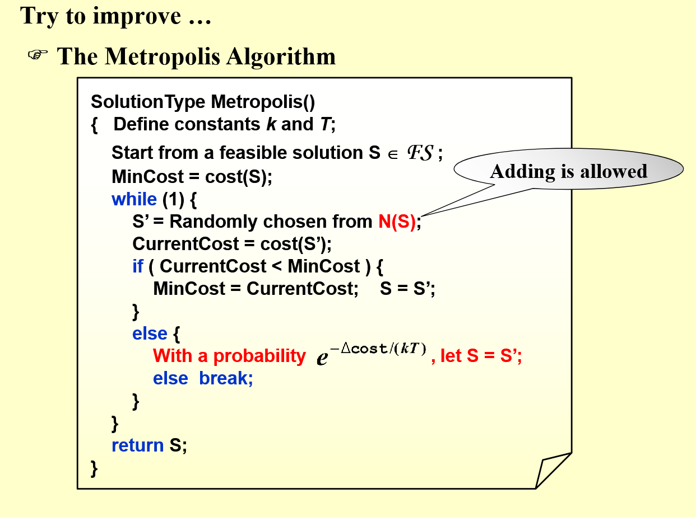

# Local Research算法（局部研究算法）
>是指在计算机科学、人工智能、优化问题等领域中，算法通过局部搜索（而不是全局搜索）来求解问题。它常用于解决那些问题规模较大、无法进行全局搜索或全局优化的情况。局部搜索算法通常从一个初始解开始，并通过在其邻域内寻找更好的解来逐步改进，直到满足某种停止条件。

主要特点：
1. 局部性：算法通过探索当前解的邻域来寻找更好的解。
2. 迭代过程：通常会反复进行局部调整，直到找到最优解或达到停止准则。
3. 计算效率：相较于全局搜索，局部搜索往往更加高效，但也容易陷入局部最优解。

## 案例
### #Vertex Cover Problem
给定一个无向图，求最小的子点集，使得每条边都至少有一个顶点在点集中。
局部算法：
开始设置点集为全体，然后随机删除点，如果仍满足条件，就继续删。
显然很容易失效，陷入局部最优解。

改进：
以一定的概率向点集中添加点

### #模拟退火(Simulated Annealing)
模拟退火的主要步骤：

1. 初始化：从一个初始解开始，设定初始温度（T）、冷却速度（通常为小于1的常数）和终止条件（如温度降到某个阈值）。
2. 迭代过程：
>1. 在当前解的邻域中随机选取一个新的解。
>2. 计算新解与当前解的能量（目标函数值）差值。如果新解更好（即目标函数值更小或更大，取决于问题），则接受新解。
>3. 如果新解较差，按照一定的概率接受它。接受概率通常与能量差（目标函数差）和当前温度成正比。
>4. 温度逐步降低（按照预设的冷却计划），减少接受较差解的概率。
3. 终止条件：当温度降到预设的最小值，或者满足其他终止条件时，停止算法，输出当前解作为近似的最优解。

接受新解的概率：

当新解的能量（目标函数值）比当前解差时，模拟退火使用下式来确定是否接受新解：
    **P(accept)=exp⁡(−ΔE/T)**
