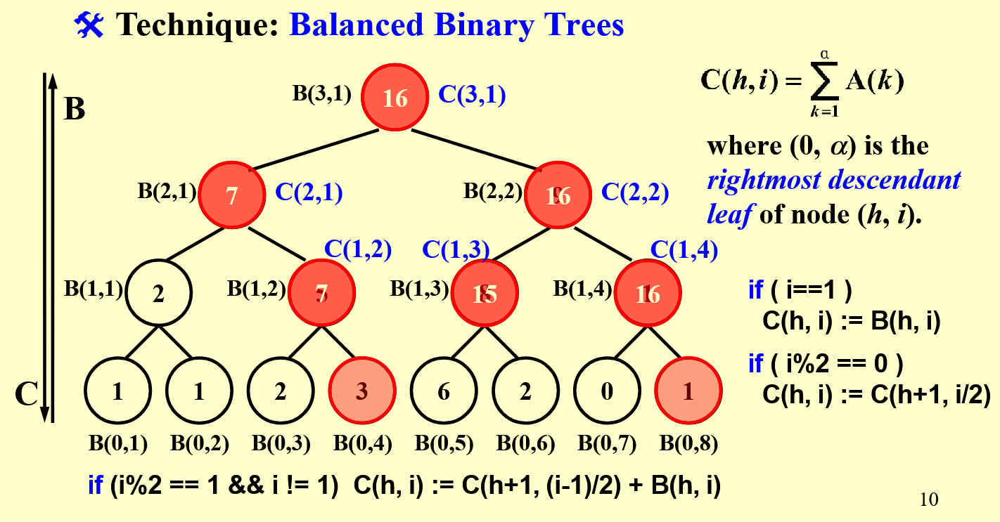

# 并行算法

## 模型类型
**Parallel Random Access Machine(PRAM)**
会让空闲的处理器处于待机状态，过度解释了每一个处理器应该干什么，会造成不必要的资源浪费
**Work-Depth(WD)**
不解释空闲的处理器应该干什么，交给系统自由调配
## 处理冲突
EREW ：每次只允许一个处理器读，写
CREW ：可以同时读，不能同时写
CRCW ：可以同时赌，也可以同时写
## 算法分析
#### 工作负载(Workload) - 总操作数：W(n)
#### 最坏运行时间：T(n)
其他表示方法：
1. P(n) = W(n) / T(n) 处理器数
>   公式 P(n) = W(n) / T(n) 表明，当有 P(n) 个处理器时，能够在 T(n) 时间内完成 W(n) 个操作。
2. W(n) / p  操作数
>    W(n) / p 表示如果你使用了 p 个处理器来并行化任务，每个处理器要完成的操作数是 W(n) / p。
>    但是，p 必须小于或等于 W(n) / T(n)，以保证最坏运行时间至少是T(n)

3. W(n) / p + T(n) 时间使用 p 个处理器
>   这表示使用 p 个处理器时，计算任务分为两部分：W(n) / p 和 T(n)。
    W(n) / p：是 p 个处理器并行执行时，每个处理器需要完成的操作数。
    T(n)：表示最坏情况下，任务中可能仍然存在一些不可并行化的部分，或者每个处理器间的同步开销等。
    因此，W(n) / p + T(n) 表示的是使用 p 个处理器时所需的总时间，其中 W(n) / p 是并行执行部分所需的时间，而 T(n) 是由于同步、依赖关系或某些串行部分导致的额外时间开销。

## 例子
#### #连加器
#### #前缀和

>
    //B(h,i)表示该子树下的部分和
    //C(h,i)表示该子树下(到该子树最右孩子)的前缀和
    //前缀和等于该子树的部分和加上前面的前缀和
    if(i==1)
        C(h,i):=B(h,i)
    if(i%2==0)
        C(h,i):=C(h+1,i/2)
    //右孩子和父亲的最右孩子是同一个，前缀和相同
    if(i%2==1 && i!=1)
        C(h,i):=C(h+1,(i-1)/2 + B(h,i))
    //左孩子的前缀和等于前面子树的前缀和加上该子树的部分和
#### #合并排序
#### Ranking:
>
    for Pi , 1 <= i <= n  pardo
        C(i + RANK(i, B)) := A(i)
    for Pi , 1 <= i <= n  pardo
        C(i + RANK(i, A)) := B(i)
>Binary Search:
T(n) = O(log(n))
W(n) = O(nlog(n))

>Serial Search:
T(n)=W(n)=O(n+m)

#### # 

