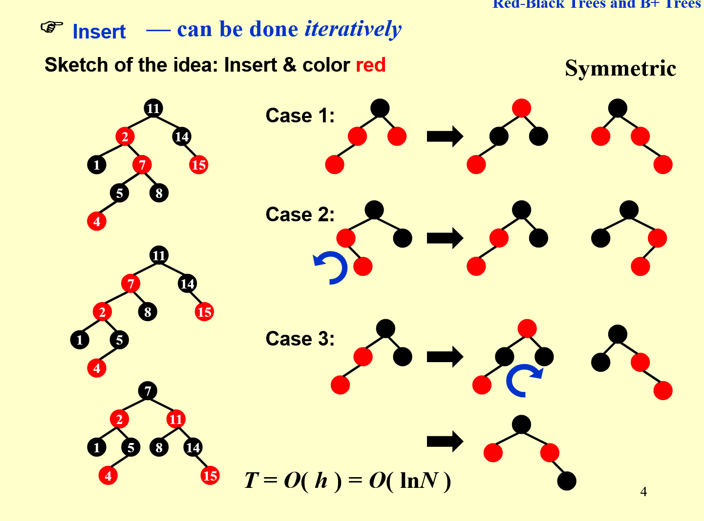
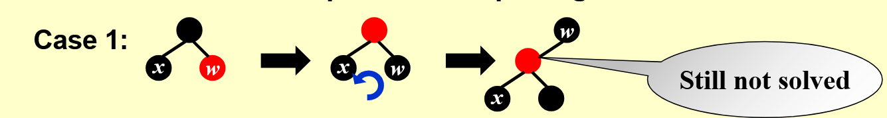
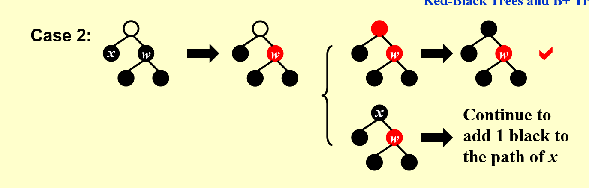
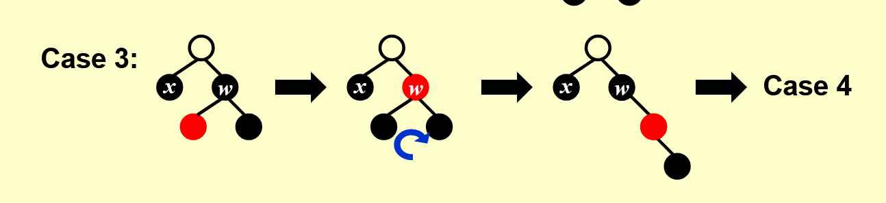
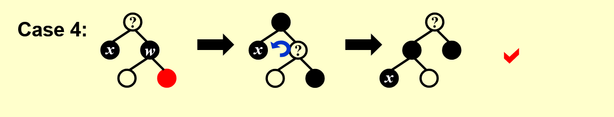

# 红黑树
定义：
1.给每个节点上黑色或者红色
2.根节点为黑色
3.相邻的两个节点不能都为红色
4.定义叶子节点为NIL，即末端节点的两个NULL指针，为黑色
5.从根节点到每个NIL节点，路径上的黑色节点数量（黑高）相同

## 插入操作
新插入的节点默认为红色
出现矛盾即父节点也为红色，爷节点一定不为虹色

**Case 1**
叔节点为红色：将父节点和叔节点都改为黑色，爷节点改为红色。然后将爷节点视为新插入的节点进行递归判断。
**Case 2**
叔节点为黑色，且不满足LL型或者RR型：
先将父节点左旋（或右旋），转化为Case 3
**Case 3**
叔节点为黑色，且为LL型（或者RR型）：
先将父节点改为黑色，爷节点改为红色，此时满足颜色规则。但是注意到左子树黑高不变的情况下，右子树黑高减小了，所以此时需要将爷节点右旋，将改为黑色的父节点放到爷节点的位置，使黑高平衡。

## 删除操作
1.要删除的点没有孩子：直接用NIL替代
2.有一个孩子：替换为孩子节点的值，删除孩子节点
3.有两个孩子：用左边最大或者右边最小的孩子替代，然后删除该孩子节点。

如果要删除的孩子节点是红色，那么不影响黑高，可以直接删除。
如果要删除的孩子节点是黑色，那么应该把这个节点标记为**因为调整导致黑高减一的节点**，进行递归调整，在调整完再删除这个节点，接下来展示四种情况。

#### Case1 兄弟节点为红色

将父亲节点染为红色，兄弟节点染为黑色，左旋，此时x黑高不变，转化为其他case

#### Case2 兄弟节点为黑色&&两孩子都为黑色

将兄弟节点染为红色，此时X和兄弟节点都是黑高减一的树
2.1：如果父亲是红色，那么将父亲改为黑色，则两个孩子的黑高都得到补偿，解决！
2.2：如果父亲是黑色，那么将父亲标记为X，即这颗子树黑高减一，进行递归处理。如果父亲是根，则整棵树的黑高都减一，不违反红黑树的性质，解决！

#### Case3 兄弟节点是黑色&&左红右黑

兄弟节点和左孩子交换颜色，然后右旋，转化为case4
#### Case4 兄弟节点是黑色&&右孩子为红

交换父亲和兄弟节点的颜色，将右孩子染黑，然后将父亲节点左旋，此时平衡了X和右孩子节点的黑高，解决！

# B+树
真实的数据都储存在叶子节点中，非叶子节点只存储指针。
**M阶B+树叶子节点最多储存M个数据，非叶子节点最多储存M-1个值**。每个叶子节点至少要储存M/2个值。

##### 查找
类似于二叉树的查找。

#### 插入
先找到要插入的位置，然后插入值，如果存储超过上限就分裂，把中间值插入父亲节点，递归分裂。

