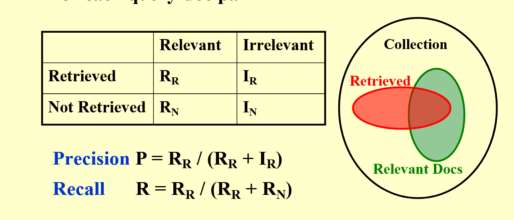

# 倒排索引

## 实现
扫描文档，对每个词做如下记录：
出现次数，出现位置

## 改进
滤去停用词 a，the等
词干分析 word stemming 将同一个词的不同形式记录为同一个词，甚至将拼写错误也归为同一个词

## 分布式存储
1. 根据单词内容进行分布式
能提升索引效率。但是会造成单点故障，容灾能力差
2. 根据文档进行分布式
有较强的容灾性能

## 性能评估

精确度：返回中相关样本量/返回总样本量
回报率：返回中相关样本量/总相关样本量