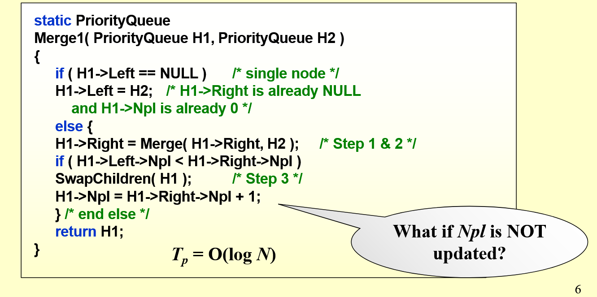

# 左偏堆（支持堆的快速合并）

## 概念
每个节点有一个新的值**Npl**，即从这个节点到叶子节点的距离
1.如果一个节点左孩子或者右孩子为空，那么dist=0
2.如果两个孩子都不为空，Npl=min{Npl(left),Npl(right)}+1

左偏堆要求每个节点左孩子的Npl不小于右孩子的Npl，每次合并的时候向右侧，即Npl比较小的那一侧塞入东西，再回溯维护左斜性质。这样能保持这个树两侧相对平衡

## 操作
### 合并
递归版本：

上述伪代码忽略了比较根节点大小的部分
>
    if(H1->val > H2->val) swap(H1,H2);
将小的值作为跟，然后将右子树和H2合并的结果作为新的右子树，然后在回溯的时候比较左右孩子的Npl，如果违反了规则就交换。

迭代写法：
用两个指针分别指向H1,H2的根，root指向合并完的树的根，方便进行从上而下的调整。
>
    Merge2(PriorityQueue H1,PriorityQueue H2)
    {
        LeftistNode *root=NULL,*cur=NULL;
        //cur指向当前节点，应将合并后结果作为cur的右子树。
        while(H1!=NULL && H2!=NULL)
        {
            if(H1->val > H2->val)swap(H1,H2);
            if(root==NULL)
            {
                root = cur = H1;
            }
            else
            {
                cur->right = H1;
                cur = cur->right;
            }
            H1 = H1->right;
        }
        while(H2!=NULL)
        //同上，也要注意第一次的时候更新root（如果H1=NULL）

        root = adjust(root);
        return root;
    }

    LeftistNode *adjust(LeftistNode* root)
    {
        //因为合并的时候只向最右侧插入了新节点
        //所以只需要更新最右侧路径上所有节点的Npl即可。
        LeftistNode *cur=root,*next;
        //每次只更新右侧的，交换完也只更新next节点
        while(cur！=NULL)
        {
            next=cur->right;
            if(cur->Left->Npl < cur->right->Npl)
            {
                cur->Npl=cur->right->Npl+1;
                swap(cur->left,cur->right);
            }
            cur=next;
            //这里没有写边界情况（懒
        }
    }
    
>复杂度分析：比较次数和回溯次数都等于两个数的最右侧路径上节点数量之和，根据左斜堆的性质，节点数量不会多于logn，所以总的时间复杂度：
T(n)=O(log(n))
------
### 插入
视为和只有一个节点的左偏堆合并
T(n)=O(log(n))
### 删除
将被删除节点的两个孩子合并为新的堆，用根节点代替被删除的节点。
T(n)=O(log(n))
# 斜堆

和左斜堆类似
但是每次合并之后无条件交换左右子树