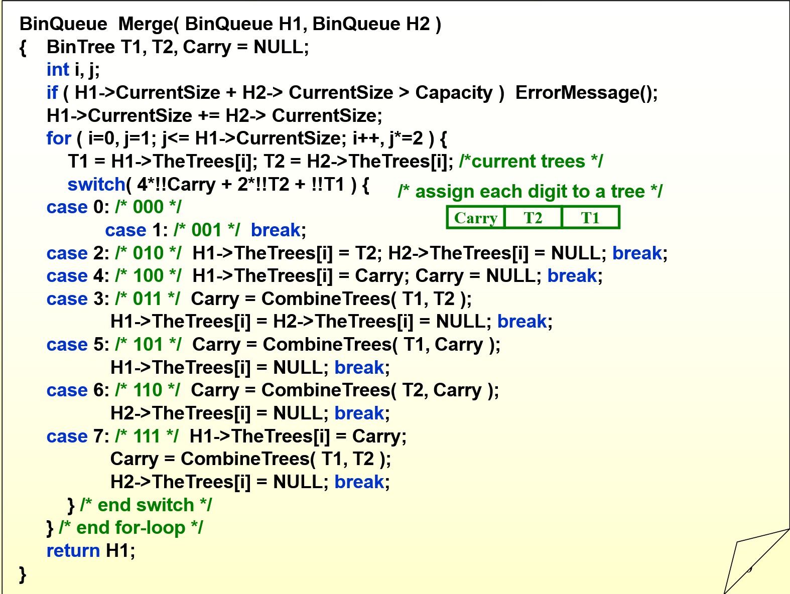
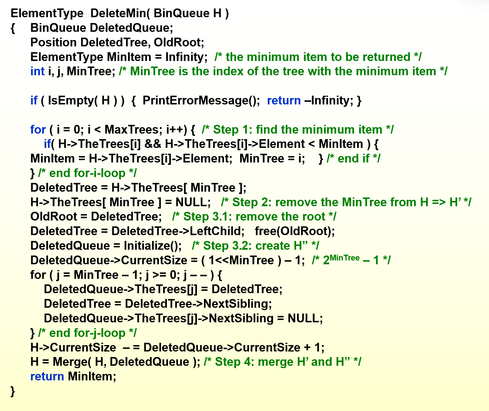
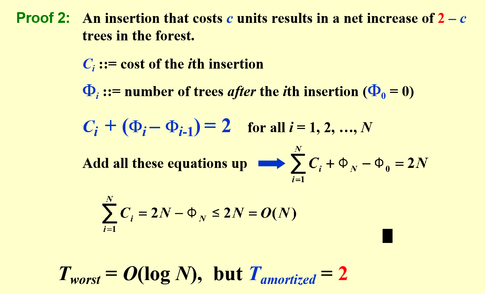

# 二项队列
## 概念
二项树：
二项树满足堆的性质，即parent节点的值小于孩子节点。
任意的k阶二项树都是同构的，有两个k-1阶二项树合并而成。也就是说k阶二项树的大小是2^k。

二项队列中存储的是二项树的根节点。

## 操作
### FindMin
min节点只能是所有二项树的根之一，遍历所有根时间复杂度为:
T(n)=log(n)
### Merge
两个二项树合并可以视为两个二进制数相加，将同阶的二项树合并只需要O(1)复杂度，最多发生log(n)数量级的进位，故:
T(n)=log(n)
#### BinTree
>
    BinTree CombineTrees(BinTree T1,BinTree T2)
    {
        if(T1->element > Te->element)
            return Combine(T2,T1);
        T2->NextSibling = T1->LeftChild;
        T1->LeftChild = T2;
    }
从这里可以看出二项树的孩子Size是递减的，在合并的时候要注意。

合并操作：自己模拟一个加法器，carry表示进位
### Insert
和只有一个节点的树的特殊合并
T(n)=log(n)
### Deletemin
1. Findmin T=O(log(n))
2. remove node T=O(1)
3. 遍历所有孩子生成新的二项队列 T=O(log(n))
4. 合并两树 T=O(log(n))
综上T=O(log(n))

考点：CurrentSize = 2^MinTree-1 = 1<<MinTree;
二项树的孩子Size是递减的，所以新建树的时候j循环应该是递减的，TheTrees从MinTree-1开始

### 摊还分析
