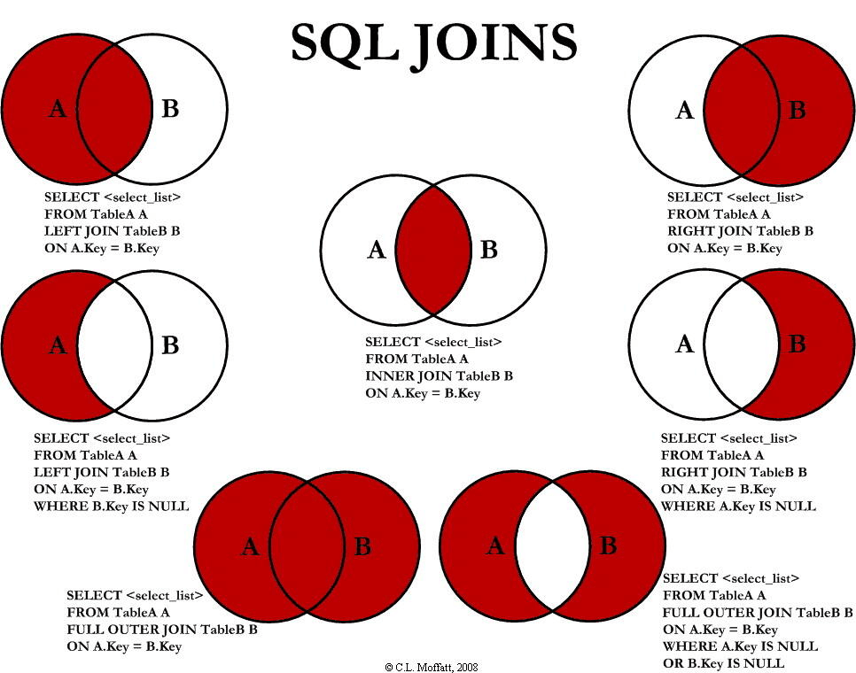
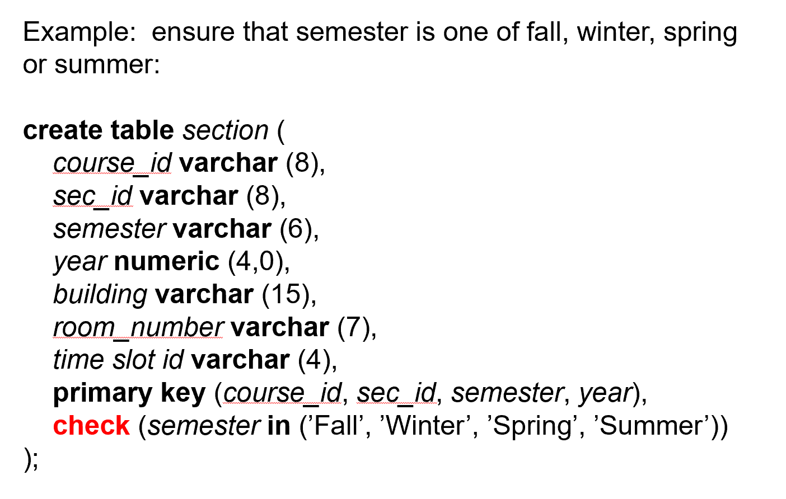
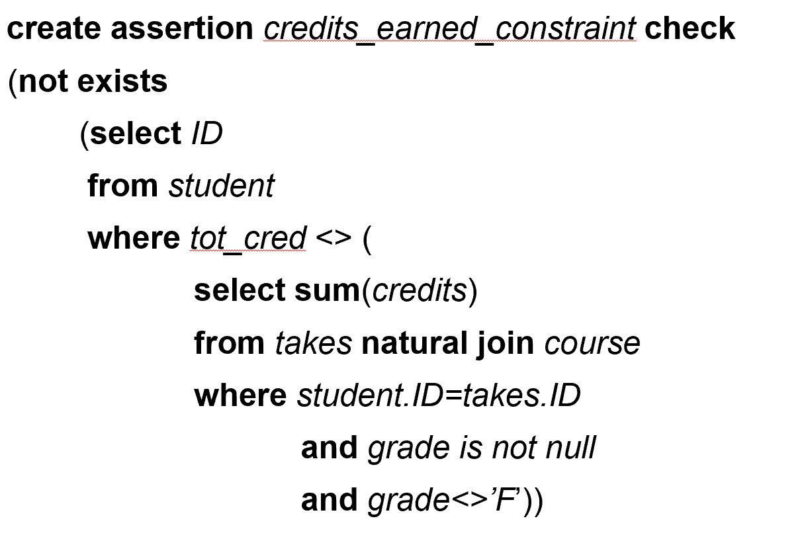
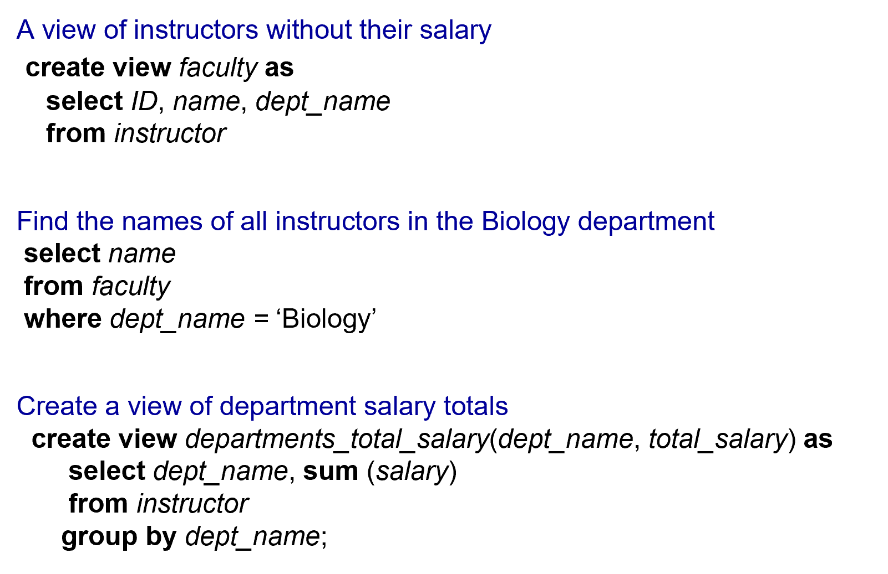

# Intermediate SQL

## 1 Join



| 类型                | 描述                                                         |
| ------------------- | ------------------------------------------------------------ |
| **INNER JOIN**      | 返回两个表中满足连接条件的记录（交集）。                     |
| **LEFT JOIN**       | 返回左表中的所有记录，即使右表中没有匹配的记录（保留左表）。 |
| **RIGHT JOIN**      | 返回右表中的所有记录，即使左表中没有匹配的记录（保留右表）。 |
| **FULL OUTER JOIN** | 返回两个表的并集，包含匹配和不匹配的记录。                   |
| **CROSS JOIN**      | 返回两个表的笛卡尔积，每条左表记录与每条右表记录进行组合。   |
| **SELF JOIN**       | 将一个表与自身连接。                                         |
| **NATURAL JOIN**    | 基于同名字段自动匹配连接的表。                               |

* using 是一个等值连接，类似于自然连接，这些属性相同才能连接


## 2 SQL Data Types and Schemas

### 2.1 User-Defined Types

`create type` construct in SQL creates user-defined type.  

`create type Dollars as numeric (12,2) final` 定义了 `Dollars` 这个类型后，我们就可以把它当作元类型使用。

```
CREATE table department
    (dept_name varchar (20),
    building varchar (15),
    budget Dollars);
```

这样可以支持强类型检查，可以防止如 200 美元 + 300 RMB 得到 500 元的错误。


### 2.2 Domain

CREATE DOMAIN 可以限制变量的取值范围

```
create domain person_name char(20) not null
create domain degree_level varchar(10)
    constraint degree_level_test
    check (value in (’Bachelors’, ’Masters’, ’Doctorate’));
```

这里的 constraint 可以对 domain 的取值进行限制。

### 2.3 Large-Object Types[¶](https://note.hobbitqia.cc/DB/db4/#large-object-types)

Large objects (photos, videos, CAD files, etc.) are stored as a large object:  

**blob**: binary large object -- object is a large  collection of uninterpreted binary data (whose interpretation is left to an application outside of the database system)
 存储大对象数据类型，实际上只是存放指针。

BLOB in MySQL 

* TinyBlob ：  0 ~ 255 bytes. 
* Blob： 0 ~ 64K bytes. 
* MediumBlob ： 0 ~ 16M bytes. 
* LargeBlob : 0 ~ 4G  bytes.

**clob**: character large object -- object is a large collection of character data
 文本大对象


## 3 Intergrity Constrains

* **`not null`**

* **`primary key`**

* **`unique`** 

   `unique(A1, A2, ..., Am)` The unique specification states that the attributes `A1, A2, ..., Am` form a **super key** （不一定是 candidate key)
   比如学生个人信息，我们知道 ID 是主键，但实际上邮箱、电话号码等也不能相同的，所以我们要通过语句告诉数据库，数据库会为我们维护这些约束条件。  
   Candidate keys are permitted to be null (in contrast to primary keys).  

* **`check (P)`**, where P is a predicate  

 

* **`assertion`**
   `create assertion <assertion-name> check <predicate>;`  

  验证一个学生获得的总学分，要等于获得的每门课的学分的总和。

  

但使用 `assert` 后，每个元组的每次状态更新时都要进行检查，开销过大，数据库一般不支持。


## 4 View

 

### 4.1 Definition

将一个table中某几列拿出来作为一个视图，类似于创建一个新的表格。

 

view 可以隐掉一些细节，或者加上一些统计数据。可以把 view 当作表进行查询。

- 隐藏不必要的细节，简化用户视野
- 方便查询书写
- 有利于权限控制（如用户可以看到工资总和，但不能看到每个人的工资）
- 有独立性，使得数据库应用具有较强的适应性。


### 4.2 Update of a View

对View修改等价于对原表进行修改。

因为View的元素数量比原表少，所以插入的时候View中缺少的数据会用 `null`补足，如果这个元素有 not null 的constraint ，这次插入将会失败


## 5 Index

Index 相当于在数据上建立了 B+ 树索引。（物理层面）

```
create table student    
(   ID varchar (5),
    name varchar (20) not null,
        dept_name varchar (20),
            tot_cred numeric (3,0) default 0,
                primary key (ID) )
create index studentID_index on student(ID)
```

`select * from student where ID = ‘12345’` 在数据库内不同的物理实现有不同的查找方法。
 如果没有定义索引，只能顺序查找。如果有索引，系统内会利用索引查找。  


## 6 Transactions

- Transactions begin implicitly
   Ended by commit work or rollback work  
- By default on most databases: each SQL statement commits automatically  
  - Can turn off auto commit for a session ***e.g.\*** in MySQL, `SET AUTOCOMMIT=0;`  

数据库中默认操作一次向数据库提交一次，这样如果账户A向账户B转账，A账户钱减少的时候断电了，B没有收到钱，就出现了问题。为了维护操作的原子性，或者方便回滚，可以设置AUTOCOMMIT = 0 关闭自动提交，每做完一次原子性操作之后手动提交。


```
SET AUTOCOMMIT=0

UPDATE account SET balance=balance-100 WHERE ano=‘1001’;
UPDATE account SETbalance=balance+100 WHERE ano=‘1002’;
COMMIT;

UPDATE account SET balance=balance -200 WHERE ano=‘1003’;
UPDATE account SET balance=balance+200 WHERE ano=‘1004’;      COMMIT;

UPDATE account SET balance=balance+balance*2.5%;
COMMIT;
```


### 6.1 ACID Properties

A  transaction  is a unit of program execution that accesses and  possibly updates various data items.To preserve the integrity of data  the database system must ensure: (原子性、一致性、独立性、持续性)

- **Atomicity**. Either all operations of the transaction are properly reflected in the database or none are.

- **Consistency**. Execution of a transaction in isolation preserves the consistency of the database.
   数据库执行事务前后都是一致的。

- Isolation

  . Although multiple transactions may  execute concurrently, each transaction must be unaware of other  concurrently executing transactions.  Intermediate transaction results  must be hidden from other concurrently executed transactions.  

  很多事情共同执行，他们不能互相影响。

  - That is, for every pair of transactions 

 and , it appears to  that either , finished execution before  started, or  started execution after 

-  finished.

**Durability**. After a transaction completes  successfully, the changes it has made to the database persist, even if  there are system failures. 
 数据库的事务一旦提交，这个修改就要持续地保存到数据库中去，不能丢失。如磁盘出问题了，断电了等会引发这个问题。
 通常使用日志。


