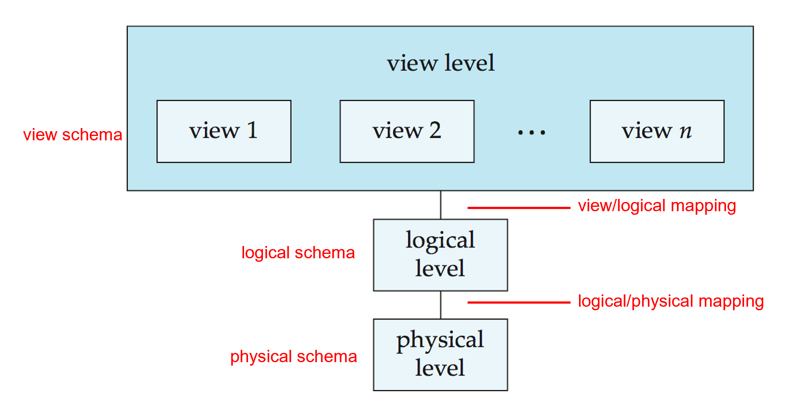

# Introduction 数据库介绍

## 1 Database System

DBMS (Database Management System)

  

## 2 Purpose of Database

Database systems offer solutions to all the below problems.  

- data redundancy (数据冗余) and inconsistency
- data isolation (数据孤立，数据孤岛)
- difficulty in accessing data
- Integrity problems (完整性问题)
  - 完整的约束条件被藏在数据和代码中，而不是显式地声明。 ***e.g.*** "account balance ≥ 1"

- Atomicity problems (原子性问题)
  - Failures may leave database in an inconsistent state with partial updates carried out ***e.g.*** 从 A 账户转账到 B, 我们必须保证 A 转出 B 转入这两件事同时进行，不能被打断。
- Concurrent access anomalies (并发访问异常)
  - Uncontrolled concurrent accesses can lead to inconsistencies

 Example 

## 3 Characteristics of Databases

- data persistence (数据持久性)
- convenience in accessing data (数据访问便利性)
- data integrity(数据完整性)
- concurrency control for multiple user (多用户并发控制)
- failure recovery (故障恢复)
- security control (安全控制)

## 4 View of Data

Three-level abstraction of databases  

  

不同用户可以看到的数据不一样，保证用户只看到自己需要的信息，界面简洁。不同权限的用户看到不同级别的信息，方便管理。

- physical level: 物理中如何保存、实现（如磁盘）
- logical level: 数据库中存储什么数据？数据之间的关系？
- view level: 不同人看到不同的他们所需要的数据

Advantages:  

- Hide the complexities

- 

      
Example

  

### 4.1 Schema and Instance

类似于类和物体之间的关系

- **Schema** (模式)– the logical structure of the database (physical/logical)
- **Instance** (实例) – the actual content of the database at a particular point in time 

### 4.2 DataIndependence

- **Physical Data Independence** (物理数据独立性) – the ability to modify the physical schema without changing the logical schema 更改物理存储，比如磁盘等但是无需改变逻辑结构
- **Logical Data Independence** (逻辑数据独立性) - the ability to modify the logical schema without changing the user view schema 更改信息逻辑结构，但是无需更改用户访问接口

## 5 Data Models

